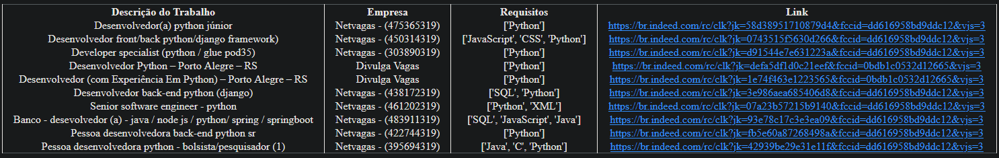

# Um bot de webscraping do site Indeed usando selenium

## Demonstração:

## Características:

### Esse bot permite pesquisar por empregos no Indeed.com e retorna uma lista com:

-Título
-Empresa
-Requisitos
-Link para candidatura
  
## Pré-requisitos:
   <ul>
   <li>Python</li>
   </ul>

## Instruções de uso:

## Crie e ative um virtual environment:

    Windows:
        Crie a venv usando o comando python -m venv nome_da_venv (exemplo: python -m venv venv).
        Ative a venv usando o comando .\nome_da_venv\Scripts\activate (exemplo: .\venv\Scripts\activate).

    Linux e macOS:
        Crie a venv usando o comando python3 -m venv nome_da_venv (exemplo: python3 -m venv venv).
        Ative a venv usando o comando source nome_da_venv/bin/activate (exemplo: source venv/bin/activate).

### Use o comando:

    pip install -r requirements.txt

### Use o comando:

    python main.py

### Baixe o chromedriver

    Faça o download do chromedriver em https://chromedriver.chromium.org/downloads de acordo com a sua versão do chrome e coloque na raiz do diretório.

### Coloque os parâmetros

    Coloque os parâmetros de pesquisa, quantidade de páginas a serem pesquisadas e quais palavras deve ser excluídas do título dos resultados.

### Abrir o resultado

    Depois é só abrir o resultado que é salvo como indeed.html

